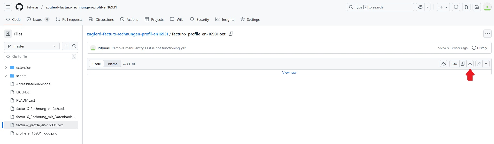
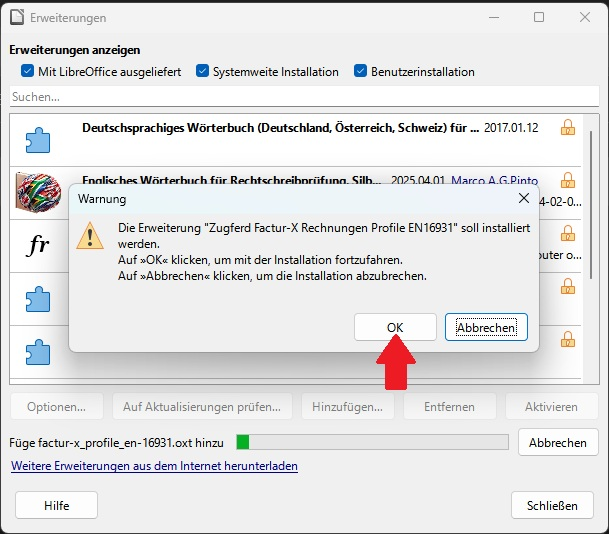
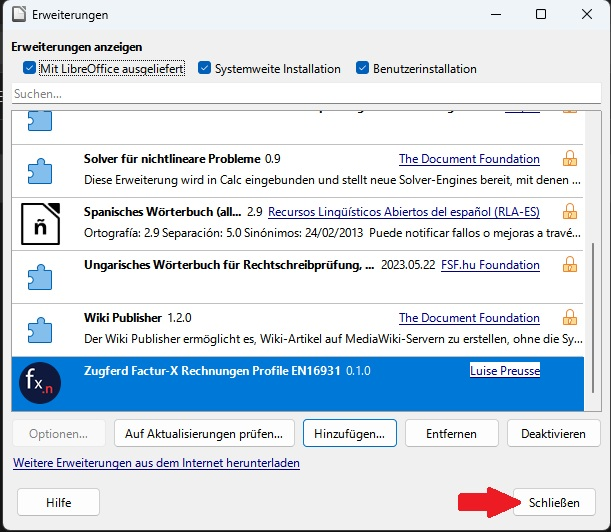

# Benutzerhandbuch

## Installation

### Installation von LibreOffice

Unter https://de.libreoffice.org/download/download kann LibreOffice heruntergeladen werden. Es sollte Version 25.2.5 oder neuer installiert sein. Falls Sie Hilfe bei der Installation benötigen, finden Sie eine Anleitung [hier](https://de.libreoffice.org/get-help/install-howto/)

### Installation der Erweiterung

Laden Sie die Datei `factur-x_profile_en-16931.oxt` von gitlab [hier](https://github.com/Pityrias/zugferd-facturx-rechnungen-profil-en16931) herunter. Klicken Sie dazu auf die Datei und anschließend auf den `Download raw` Button oben rechts. 

Öffnen Sie die heruntergeladene Datei mit einem Doppelklick um die Erweiterung zu installieren.

Die Erweiterung wird nun als installiert angezeigt. Klicken Sie auf `Schließen` und wählen Sie `Später neu starten` aus.

## Erstellen einer Rechnung

### Herunterladen der Vorlage

Die Erweiterung liest die Daten für den xml-Teil der E-Rechnung aus einer speziell formatierten Tabelle im zweiten Tab der Rechnungsdatei aus. Eine Rechnungsvorlage namens `factur-x_Rechnung_einfach.ods` kann [hier](https://github.com/Pityrias/zugferd-facturx-rechnungen-profil-en16931) heruntergeladen werden. Öffnen Sie die Vorlage durch einen Doppelklick.

### Einstellungen zur Makrosicherheit

Da Makros aus unbekannten Quellen ein Sicherheitsrisiko darstellen können, sind die meisten Makros in der Standardeinstellung von LibreOffice deaktiviert. Damit diese Erweiterung funktionieren kann, muss diese Einstellung angepasst werden.

Sind Makros deaktiviert, sieht die Datei nach dem Öffnen wie folgt aus:

In diesem Fall klicken Sie in der Menüleiste auf `Extras` und dann auf `Optionen`. In folgendem Dialog wählen Sie den Unterpunkt `Sicherheit` unter `LibreOffice` aus. Dort finden Sie einen Button `Makrosicherheit`. Klicken Sie ihn an und wählen Sie dann den Punkt `Mittel` aus. Mit dieser Einstellung werden Sie bei jedem Öffnen eines Dokuments gefragt, ob Sie Makros erlauben wollen. Klicken Sie auf beide `OK` Buttons und starten Sie LibreOffice neu, damit die Änderungen wirksam werden.

Beim Start sollten Sie jetzt folgenden Dialog sehen.

Klicken Sie auf `Makros aktivieren`.

**Hinweis: Makros können Schadsoftware enthalten. Aktivieren Sie Makros nur in Dokumenten, denen Sie vertrauen.**

### Testen des Makros

Die Datei `factur-X_Rechnung_einfach.ods` sollte jetzt offen sein, ohne dass eine Warnung zur Makrosicherheit am oberen Rand angezeigt wird. Testen Sie die Erweiterung anhand der Vorlage. 

Führen Sie folgende Schritte aus:
1. Klicken Sie am unteren Bildschirmrand auf den Tab `Rechnung` umd die Rechnungsansicht anzuzeigen. (siehe Bild Rechnungsansicht)
2. Prüfen Sie, dass das Feld `Datum:` das aktuelle Datum enthält.
3. Scrollen Sie nach unten und prüfen Sie, dass das Datum hinter `Zu Zahlen bis zum:` in der Zukunft liegt. Wenn nicht, ändern Sie das Datum.

4. Klicken Sie am unteren Bildschirmrand auf den Tab `Daten` um die Datenansicht zu öffnen. (siehe Bild Datenansicht)
5. Klicken Sie auf den Button `Factur-X PDF Rechnung erstellen`.

6. Wählen Sie einen Dateispeicherort aus, geben Sie einen Dateinamen ein und klicken Sie auf `Speichern`.

7. Öffnen Sie das eben erstellte PDF und prüfen Sie, dass die Datei wie erwartet aussieht. Wenn Sie Adobe Acrobat zum Öffnen verwendet haben, sollte angezeigt werden, dass eine `factur-x.xml` Datei eingebettet ist.

### Anpassen der Anzahl an Positionen oder Steuerkategorien

Das Rechnungstemplate beinhaltet drei Positionen und Steuerkategorien. Da das Hinzufügen neuer Einträge für beide Tabellen gleich funktioniert, erklärt dieses Kapitel am Beispiel der Positionsdaten. Um eine neue Position hinzuzufügen, führen Sie folgende Schritte aus:

1. Klicken Sie auf die Zeilennummer der letzten Position in der Leiste links. Nun sollte die gesamte Zeile markiert sein.

2. Klicken Sie mit der rechten Maustaste und wählen Sie "Zeilen unterhalb einfügen" aus.

3. Nun befindet sich eine leere Zeile am Ende der Tabelle.

4. Klicken Sie in die letzte befüllte Zeile der Tabelle und markieren Sie die Tabelleneinträge. Bewegen Sie den Mauszeiger an die rechte untere Ecke des markierten Bereichs. Der Curson nimmt die Form eines schwarzen Kreuzes an. Halten Sie die linke Maustaste gedrückt und ziehen Sie den Cursor über die darunterliegende Zeile. Sobald die untere Zeile mit einem pinken Rahmen hervorgehoben wird, lassen Sie die Maustaste los.

5. Die neue Zeile ist nun mit Werten befüllt. Die Positionsnummer wurde automatisch hochgezählt, andere Werte wurden aus der darüberliegenden Zeile kopiert. Passen Sie die Werte an.
6. Sobald Sie alle Positionen in der Positionstabelle haben, passen Sie die Umsatzsteueraufschlüsselung an.
7. Jetzt müssen die neuen Positionen in der Datenansicht hinzugefügt werden. Wechseln Sie in den `Daten` Tab.
8. Scrollen Sie herunter zur Positionstablelle. Fügen Sie bei Bedarf eine neue Zeile unterhalb der letzten Zeile ein. Das funktioniert wie in Schritt 2 beschrieben.
9. Wiederholen Sie Schritt 4. Markieren Sie die Inhalte des letzten Eintrags der Positionsdaten, bewegen Sie den Mauszeiger zum rechten unteren Rand und halten Sie die Maus gedrückt während Sie den nun kreuzförmigen Cursor nach unten ziehen.

10. Die neue Zeile sollte die Informationen aus der Rechnungsansicht enthalten.

Um eine Positon oder Steuerkategorie zu entfernen, wählen Sie die Zeile wie In Schritt 1 beschrieben aus, klicken Sie aber auf "Zeilen löschen".

### Wichtige Hinweise zur Rechnungserstellung

todo
- Umsatzsteueraufschlüsselung
- welche Daten eintragen
- Alternative
- Fußzeile und Note Felder

## Anpassen der Vorlage

Das Aussehen der Rechnung kann auf vielfältige Weise angepasst werden. Dieses Kapitel erklärt, welche Möglichkeiten es gibt und was zu beachten ist.

### Wichtige Hinweise

Das finale Aussehen der Rechnung ergibt sich aus der Rechnungsansicht in Tab 1 der Vorlage. Alle kosmetischen Änderungen sollten in dieser Ansicht gemacht werden. Die Datenansicht dient als Grundlage der eingebetteten xml Datei. Dabei erwartet die Erweiterung bestimmte Daten in bestimmten Zeilen. 
**Die Zeilennummer der Einträge in der Datenansicht in Tab 2 darf NICHT verändert werden. Sonst kann keine gültige E-Rechnung generiert werden.** Die meisten Einträge der Datenansicht werden aus spezifischen Zeilen der Rechnungsansicht ausgelesen. Die Zuweisung, welche Zelle in Tab 1 den gewünschten Wert enthält, darf natürlich angepasst werden.

- Datenformat Alternative erklären

### Anpassen der Rechnungsansicht

### Anpassen der Datenansicht

### Verwendung einer Adresstabelle

