# Benutzerhandbuch

- [Benutzerhandbuch](#benutzerhandbuch)
  - [Installation](#installation)
    - [Installation von LibreOffice](#installation-von-libreoffice)
    - [Installation der Erweiterung](#installation-der-erweiterung)
    - [Herunterladen der Vorlage](#herunterladen-der-vorlage)
    - [Einstellungen zur Makrosicherheit](#einstellungen-zur-makrosicherheit)
    - [Testen des Makros](#testen-des-makros)
  - [Erstellen einer Rechnung](#erstellen-einer-rechnung)
    - [Wichtige Hinweise](#wichtige-hinweise)
      - [Die Datenbeziehung ALTERNATIVE](#die-datenbeziehung-alternative)
      - [Das Profil basic](#das-profil-basic)
    - [Personalisierung der Vorlage](#personalisierung-der-vorlage)
    - [Eintragen der allgemeinen Rechnungsinformationen](#eintragen-der-allgemeinen-rechnungsinformationen)
    - [Anpassen der Anzahl an Positionen oder Steuerkategorien](#anpassen-der-anzahl-an-positionen-oder-steuerkategorien)
      - [Hinweise zu den Steuerkategorien](#hinweise-zu-den-steuerkategorien)
      - [Hinweise zu den Positionsdaten](#hinweise-zu-den-positionsdaten)
      - [Hinzufügen und Entfernen von Positonen/Steuerkategorien](#hinzufügen-und-entfernen-von-positonensteuerkategorien)
    - [Anpassen der Umsatzsteueraufschlüsselung und der Gesamtsummen](#anpassen-der-umsatzsteueraufschlüsselung-und-der-gesamtsummen)
    - [Verwendung der Vorlage mit Adressdatenbankanbindung](#verwendung-der-vorlage-mit-adressdatenbankanbindung)
    - [Adressen eintragen](#adressen-eintragen)
    - [Verknüpfung Datenquellen](#verknüpfung-datenquellen)
    - [Einfügen von Daten in die Rechnung](#einfügen-von-daten-in-die-rechnung)
  - [Weiterführende Anpassungen der Vorlage](#weiterführende-anpassungen-der-vorlage)
    - [Wichtige Hinweise](#wichtige-hinweise-1)
    - [Anpassen der Rechnungsansicht](#anpassen-der-rechnungsansicht)
    - [Anpassen der Datenansicht](#anpassen-der-datenansicht)
  - [Fehlerbehandlung](#fehlerbehandlung)

## Installation

### Installation von LibreOffice

Unter https://de.libreoffice.org/download/download kann LibreOffice heruntergeladen werden. Es sollte Version 25.2.5 oder neuer installiert sein. Falls Sie Hilfe bei der Installation benötigen, finden Sie eine Anleitung [hier](https://de.libreoffice.org/get-help/install-howto/)

### Installation der Erweiterung

Laden Sie die Datei `factur-x_profile_en-16931.oxt` von gitlab [hier](https://github.com/Pityrias/zugferd-facturx-rechnungen-profil-en16931) herunter. Klicken Sie dazu auf die Datei und anschließend auf den `Download raw` Button oben rechts. 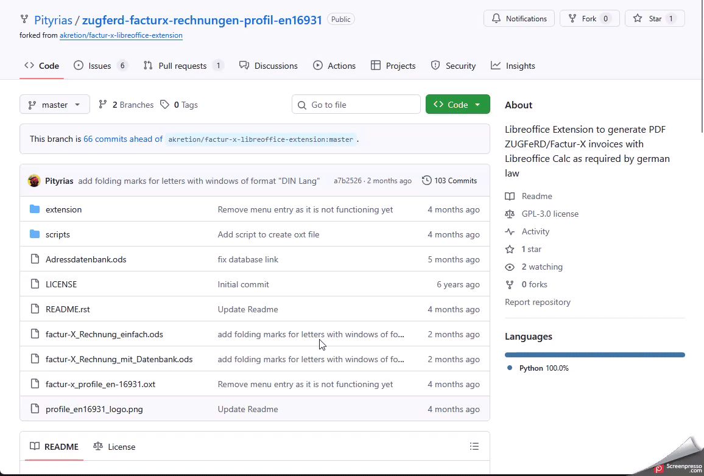

Öffnen Sie die heruntergeladene Datei mit einem Doppelklick um die Erweiterung zu installieren.
Die Erweiterung wird nun als installiert angezeigt. Klicken Sie auf `Schließen` und wählen Sie `Jetzt neu starten` aus. Falls nach dem Neustart ein erneuter Installationsdialog angezeigt wird, können Sie diesen einfach schließen.
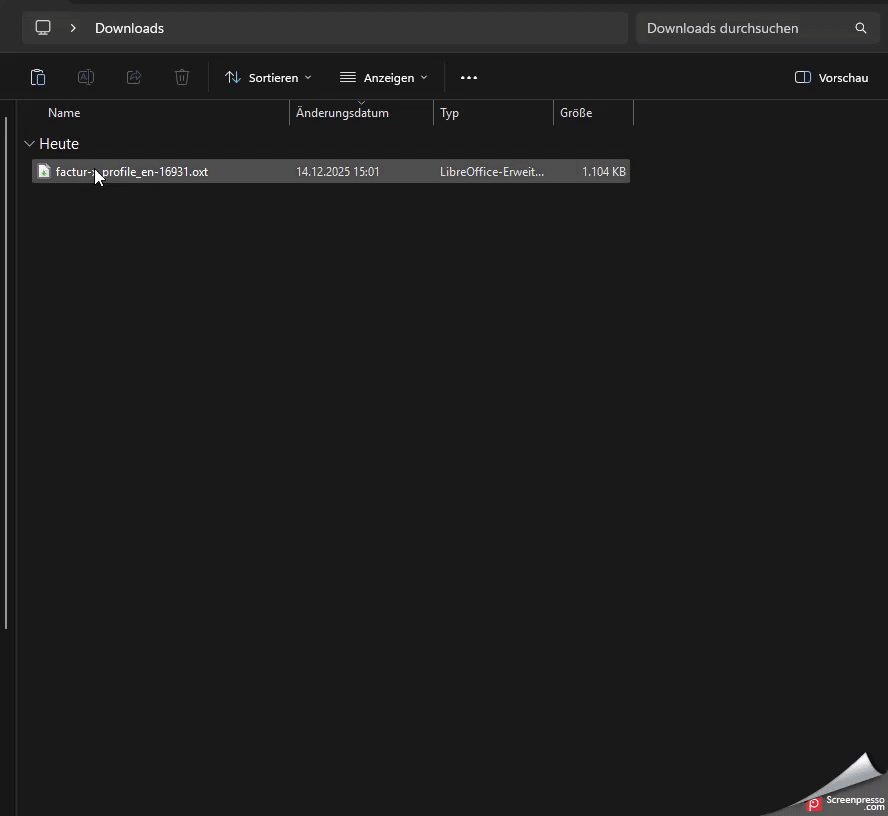

### Herunterladen der Vorlage

Die Erweiterung liest die Daten für den xml-Teil der E-Rechnung aus einer speziell formatierten Tabelle im zweiten Tab der Rechnungsdatei aus. Eine Rechnungsvorlage namens `factur-x_Rechnung_einfach.ods` kann [hier](https://github.com/Pityrias/zugferd-facturx-rechnungen-profil-en16931) heruntergeladen werden. Öffnen Sie die Vorlage durch einen Doppelklick.

### Einstellungen zur Makrosicherheit

Da Makros aus unbekannten Quellen ein Sicherheitsrisiko darstellen können, sind die meisten Makros in der Standardeinstellung von LibreOffice deaktiviert. Damit diese Erweiterung funktionieren kann, muss diese Einstellung angepasst werden.

Sind Makros deaktiviert, sieht die Datei nach dem Öffnen wie folgt aus:

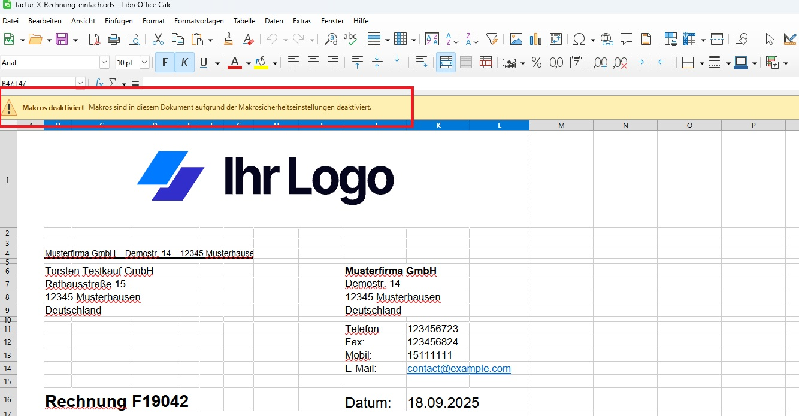

In diesem Fall klicken Sie in der Menüleiste auf `Extras` und dann auf `Optionen`. In folgendem Dialog wählen Sie den Unterpunkt `Sicherheit` unter `LibreOffice` aus. Dort finden Sie einen Button `Makrosicherheit`. Klicken Sie ihn an und wählen Sie dann den Punkt `Mittel` aus. Mit dieser Einstellung werden Sie bei jedem Öffnen eines Dokuments gefragt, ob Sie Makros erlauben wollen. Klicken Sie auf beide `OK` Buttons und starten Sie LibreOffice neu, damit die Änderungen wirksam werden.

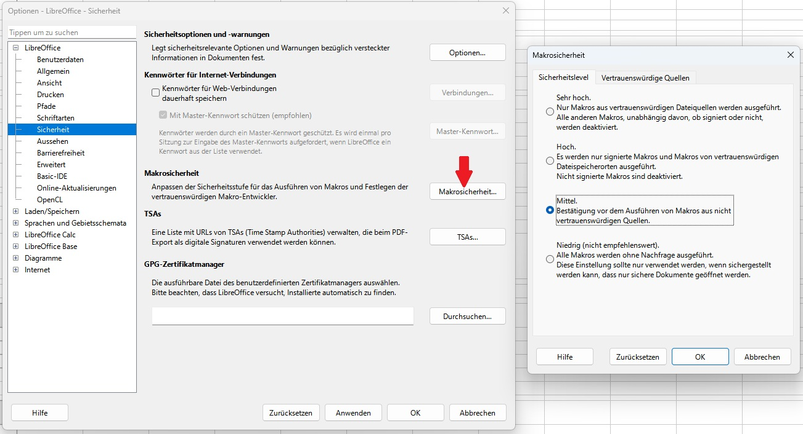

Beim Start sollten Sie jetzt folgenden Dialog sehen.

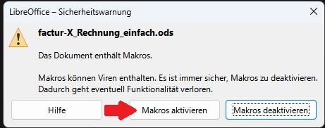

Klicken Sie auf `Makros aktivieren`.

Die Datei `factur-X_Rechnung_einfach.ods` sollte jetzt offen sein, ohne dass eine Warnung zur Makrosicherheit am oberen Rand angezeigt wird.

**Hinweis: Makros können Schadsoftware enthalten. Aktivieren Sie Makros nur in Dokumenten, denen Sie vertrauen.**

### Testen des Makros

Dieser Abschnitt testet das Zusammenspiel von Makro und Vorlage, indem eine E-Rechnung mit minimalen Anpassungen erstellt wird. Wie Sie die Vorlage für Ihre eigenen Rechnungen anpassen können, erklären spätere Kapitel. Dort finden sich auch wichtige Hinweise zu den gesetzlichen Anforderungen an die Rechnung.

Um direkt eine E-Rechnung aus der Vorlage zu erstellen, führen Sie folgende Schritte aus:
1. Klicken Sie am unteren Bildschirmrand auf den Tab `Rechnung` umd die Rechnungsansicht anzuzeigen. (siehe Bild Rechnungsansicht)
2. Prüfen Sie, dass das Feld `Datum:` das aktuelle Datum enthält.
3. Scrollen Sie nach unten und prüfen Sie, dass das Datum hinter `Zu Zahlen bis zum:` in der Zukunft liegt. Wenn nicht, ändern Sie das Datum.
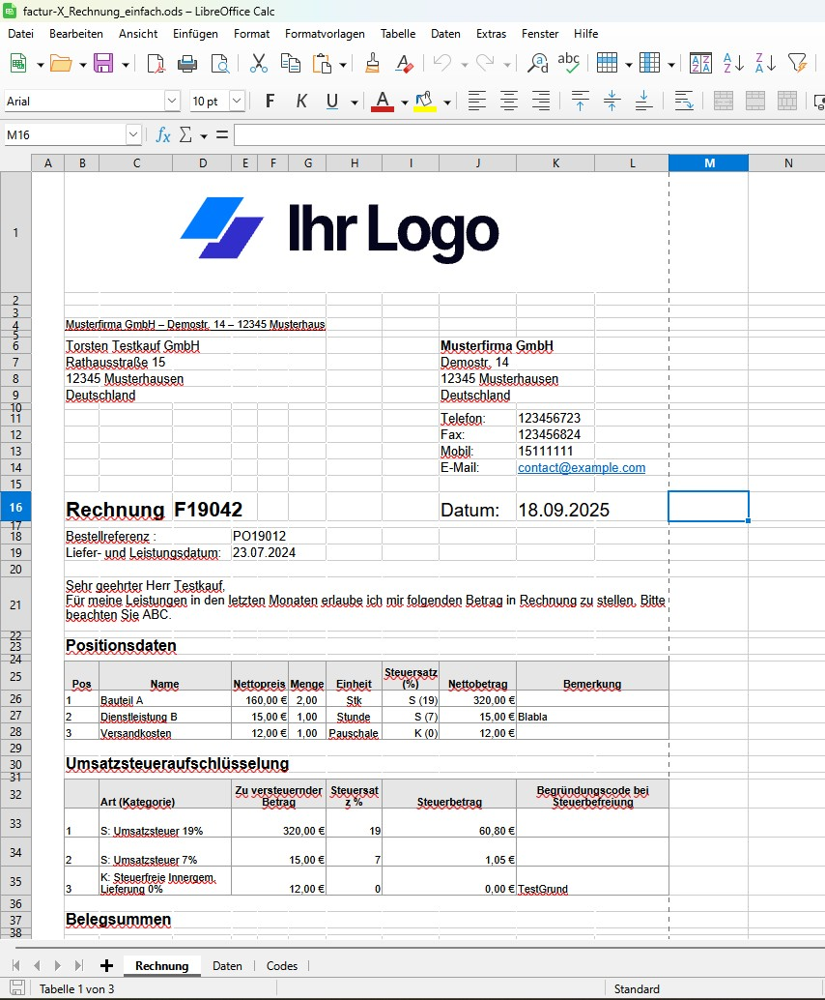
4. Klicken Sie am unteren Bildschirmrand auf den Tab `Daten` um die Datenansicht zu öffnen. (siehe Bild Datenansicht)
5. Klicken Sie auf den Button `Factur-X PDF Rechnung erstellen`.
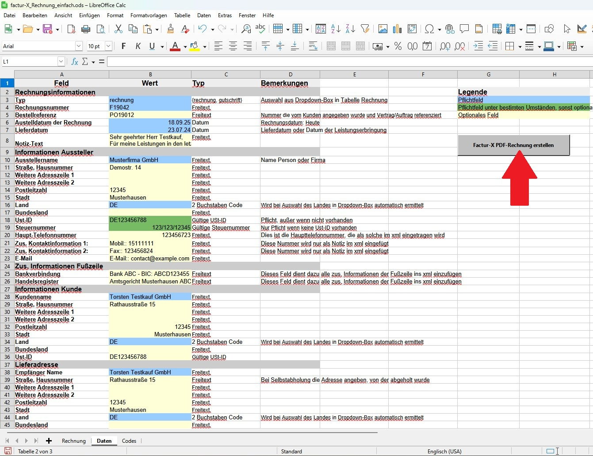
6. Wählen Sie einen Dateispeicherort aus, geben Sie einen Dateinamen ein und klicken Sie auf `Speichern`.
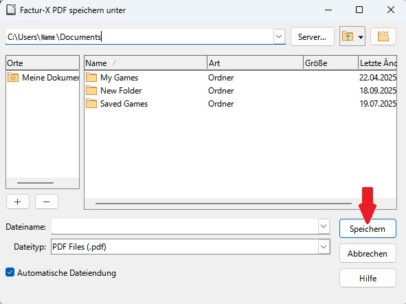
7. Öffnen Sie das eben erstellte PDF und prüfen Sie, dass die Datei wie erwartet aussieht. Wenn Sie Adobe Acrobat zum Öffnen verwendet haben, sollte angezeigt werden, dass eine `factur-x.xml` Datei eingebettet ist.
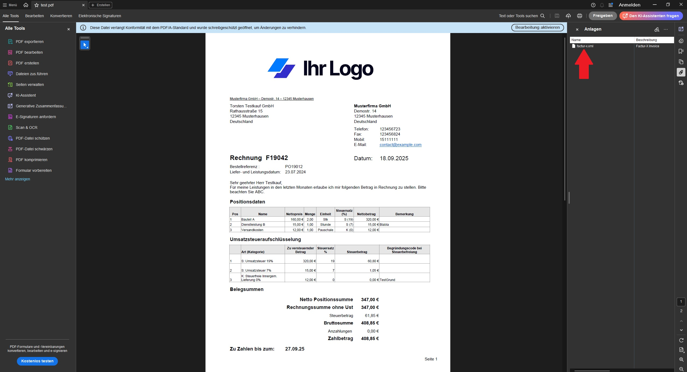

## Erstellen einer Rechnung

Dieses Kapitel erklärt was beim Erstellen Ihrer eigenen Rechnungen zu beachten ist.
Es behandelt folgende Themen:

- Wichtige Hinweise
- Personalisierung der Vorlage
- Anpassen von Datums und Freitextfeldern
- Anpassen der Positions- und Umsatzsteuerkategorien
- Anpassen der Umsatzsteueraufschlüselung und der Gesamtsummen
- Verwendung der Vorlage mit Adressdatenbankanbindung

### Wichtige Hinweise

Um sicherzustellen, dass Ihre Rechnung nach UStG gültig ist, sollte sie foldende Anforderungen aus dem Factur-X bzw. ZUGFeRD Standard erfüllen:

1. Datenbeziehung "ALTERNATIVE"
2. Mindestens Profil "Basic"

#### Die Datenbeziehung ALTERNATIVE

Die Datenbeziehung "ALTERNATIVE" bedeutet, dass die Informationen im menschenlesbaren und maschinenlesbaren Teil der Rechnung redundant sind. Für diese Rechnungsvorlage bedeutet das, dass alle Informationen aus der Rechnungsansicht auch in der Datenansicht vorhanden sein müssen - und umgekehrt. Für die meisten Felder der Datenansicht gibt es eine direkte Verknüfung zu den Werten in der Rechnungsansicht.

Folgende Felder benötigen eine manuelle Anpassung:

- Aussteller Weitere Adresszeile 1 & 2: Diese Felder erlauben es weitere Adresszeilen abzubilden. Sind sind in der Rechnungsansicht der Vorlage nicht vorhanden und müssen bei Bedarf manuell verknüpft oder manuell ausgefüllt werden.
- Aussteller Bundesland: Ist in der Rechnungsansicht der Vorlage nicht vorhanden und müssen bei Bedarf manuell verknüpft oder manuell ausgefüllt werden.
- Aussteller Umsatzsteuer-Id: Pflichtfeld, in der Vorlage ist diese Information in der Fußzeile untergebracht. Falls Sie die Fußzeile anpassen, bedenken Sie das die Umsatzsteuer-Id weiterhin in beiden Ansichten vorhanden und den gleichen Wert haben muss.
- Zus. Informationen Fußzeile: Die Rechnungsansicht der Vorlage enthält diverse, teilweise optionale Informationen. Da diese im Factur-X Standard keinem Feld zugeordnet sind, werden sie in ein Freitextfeld eingefügt. Sie können das Feld für diverse Informationen nutzen, die anders nicht in die Datenansicht passen.
- Kunde Weitere Adresszeile 1 & 2: Diese Felder erlauben es weitere Adresszeilen abzubilden. Sind sind in der Rechnungsansicht der Vorlage nicht vorhanden und müssen bei Bedarf manuell verknüpft oder manuell ausgefüllt werden.
- Kunde Bundesland: Ist in der Rechnungsansicht der Vorlage nicht vorhanden und müssen bei Bedarf manuell verknüpft oder manuell ausgefüllt werden.
- Kunde Umsatzsteuer-Id: Ist in der Rechnungsansicht der Vorlage nicht vorhanden und müssen bei Bedarf manuell verknüpft oder manuell ausgefüllt werden.
- Block Lieferadresse: Übernimmt aktuell die Anschrift des Kunden aus der Datenansicht. Muss bei abweichender Lieferadresse angepasst werden.
- Zahlungsbedingungen Text: Informationen über Besonderheiten wie z.B. Skonto können nicht direkt in der Datenansicht abgebildet werden und müssen daher im Beschreibungstext der Zahlungsbedingungen erwähnt werden.
- Währungscode: Fest auf Euro (EUR) gesetzt.
- Anzahl zusätzlicher Anhänge: Es ist möglich zusätzliche Dateien in die E-Rechnung einzubetten. Dies hat keinen Einfluss auf die Gültigkeit der Rechnung.
- Tabelle Steuerkategorie und Positionsdaten: Da die Anzahl der Positionen und Steuerkategorien schwankt, muss die Tabelle entsprechend angepasst werden. Wie das funktioniert ist im Abschnitt `Anpassen der Anzahl an Positionen oder Steuerkategorien` erklärt.

**Hinweis:** Wenn Sie eine Information in der Rechnungsansicht haben, die in kein Feld der Datenansicht passt, nutzen Sie eines der folgenden Felder:

* Notiz-Text
* Zus. Informationen Fußzeile Bankverbindung
* Zus. Informationen Fußzeile Handelsregister
* Zahlungsbedingungen Text
* Bemerkung zu Position, falls sich die Information auf eine Position bezieht

**Wichtig: Kontrollieren Sie vor der Fertigstellung jeder Rechnung, dass die Informationen in der Datenansicht mit denen der Rechnungsansicht übereinstimmen.**

#### Das Profil basic

Damit die Rechnung gültig ist, muss sie mindestens die Informationen aus dem Profil Basic des factur-x Standards beinhalten. Dieses Projekt hat noch eine Vielzahl optionaler, aber sinnvoller Informationen implementiert. Welche Information zwingend erforderlich sind, ist in der Datenansicht farbig markiert.

* Blau: Diese Informationen müssen in jedem Fall vorhanden sein
* Grün: Diese Information ist in bestimmten Situationen verpflichtend, eine kurze Erklärung dazu findet sich im Bemerkungsfeld
* Gelb: Dieses Feld ist optional

Die erste Spalte der Tabelle benennt die Information. Die zweite Spalte enthält den Wert, der in die xml-Komponente der E-Rechnung geschrieben werden wird. Diese Spalte enthält auch die Farbcodierung. Die Typ-Spalte beschreibt das Format des Wertes, also ob es sich um einen Text, ein Datum oder etwas anderes handelt. Nichtbeachtung dieses Formats führt zu Fehlern beim Erstellen der Rechnung. Die letzte Spalte entält Erklärungen zu den Inhalten einer Zeile.

Die Positions- und Steuerkategorien können eine variable Anzahl an Elementen haben und sind aus technischen Gründen anders sortiert. Hier enthält jede Zeile eine Postion oder Steuerkategorie und die zugehörigen Informationen werden in den Spalten eingetragen. Sie brauchen soviele Zeilen wie sie Positionen oder Steuerkategorien haben und es muss mindestens eine vorhanden sein. Wie sie diese Tabellen anpassen müssen wird im Abschnitt `Anpassen der Anzahl an Positionen oder Steuerkategorien` erklärt.

### Personalisierung der Vorlage

Bevor Sie ihre erste eigene Rechnung erstellen, entfernen Sie das Beispiellogo am Anfang der Rechnung. Sie können es durch ein eigenes ersetzen, indem Sie in der Menüleiste auf `Einfügen` und dann `Bild` klicken. Sie können den Bereich natürlich auch freilassen.

Die Größe des Bereichs ist so gewählt, dass das Adressfeld der ausgedruckten Rechnung unter dem Fenster eines DIN A4 Umschlags liegt. Für Briefumschlänge im Format DIN lang sind Pfalzmarkierungen auf der ersten Rechnungsseite platziert. Um diese Abstände anzupassen, können Sie die Größe von Zeile 1 und Spalte A anpassen. Beachten Sie aber, dass es einen voreingestellten Druckrand gibt, der beim Druck hinzugefügt wird. Die Einstellung dafür ist im Menü unter `Format` -> `Seitenvorlage` -> `Allgemein` im Abschnitt `Seitenränder`zu finden.

Im nächsten Schritt tragen Sie Ihre Kontaktdaten in die dafür vorgesehenen Felder im oberen rechten Bereich der Rechnung ein. Vergessen Sie nicht auch die Zeile(n) über der Empfängeradresse anzupassen. Falls Sie bestimmte Kontaktdaten nicht angeben wollen, lassen Sie das Feld frei und löschen Sie den Beschreibungstext im Feld davor. **Falls Sie die nun freie Zeile stört, verringern Sie die Größe der Zeile, löschen Sie diese aber keinesfalls und schieben Sie den Inhalt der darunter liegenden Feler auch NICHT nach oben.**

Zum Schluss füllen Sie die Fußzeile aus. Die Informationen aus den Zeilen `Bankverbindung` und `Handelsregister` werden als Freitext in die xml Datei eingefügt und können von Ihnen durch beliebige andere Informationen ersetzt oder freigelassen werden. **Von den Feldern Ust-IdNr. und Steuernummer muss mindestens eines vorhanden und ausgefüllt sein.** Für Felder die Sie nicht verwenden wollen, können Sie natürlich auch den Beschreibungstext entfernen.

Speichern Sie die veränderte Vorlage nun ab, sodass Sie diese allgemeinen Anpassungen nicht bei jeder Rechnung wiederholen müssen.

### Eintragen der allgemeinen Rechnungsinformationen

Nachdem Sie nun allgemeine Informationen über Ihr Unternehmen eingetragen haben, wird es Zeit die rechnungsspezifischen Informationen einzutragen>

- Stellen Sie ein, ob es sich um eine Rechnung oder Gutschrift/Stornorechnung handelt. Klicken Sie dafür auf das Wort `Rechnung`vor der Rechnungsnummer und dann auf den kleinen grauen Pfeil, der neben dem Feld erschienen ist, um eine Auswahl zu treffen.
- Tragen Sie die Rechnungsnummer ein.
- Das Austelldatum wird automatisch auf das aktuelle Datum gesetzt.
- Tragen Sie (wenn vorhanden) die Bestellreferenz ein, sonst lassen Sie das Feld frei
- Der Liefer- und Leistungszeitraum muss ein Datum im Format tt.mm.jjjj sein. Falls es sich um einen Zeitraum handelt, tragen Sie den letzten Tag ein.
- Schreiben Sie den Rechnungstext. Hier können Sie auch Informationen unterbringen, die in kein anderes Feld der Vorlage passen.
- Tragen Sie das Fälligkeitsdatum unter den Belegsummen ein. Dieses Datum muss in der Zukunft liegen. Das Format ist tt.mm.yyyy
- Darunter ist Platz für die Zahlungsbedingungen als Freitext. Hier können Sie auch Besonderheiten wie Skonto spezifizieren. Wir empfehlen auch die Bankverbindung hier noch einmal einzutragen.

### Anpassen der Anzahl an Positionen oder Steuerkategorien

#### Hinweise zu den Steuerkategorien

Die Steuerkategorie-Tabelle beinhaltet eine Zeile pro verwendeter Steuerkategorie, die ersten zwei Zeilen erkären die Bedeutung der einzelnen Spalten. Beachten Sie folgende Hinweise:

- Spalte A Nummer: Wird automatisch erstellt und ist aus technischen Gründen vorhanden.
- Spalte B Code: Der offizielle Coder der Steuerkategorie, aus der UNTDID 5305. Unterstützte Kategorien können Sie Tab 3 `Codes` entnehmen
- Spalte C Steuersatz: Bitte Wert ohne Einheitenzeichen eintragen
- Spalte D Summe MwSt: Bitte Wert ohne Einheitenzeichen eintragen
- Spalte E Betrag der nach Kategorie besteuert wird: Bitte Wert ohne Einheitenzeichen eintragen
- Spalte F Grund Steuerbefreiung: Bei einer Versteuerung mit 0% kann hier ein Grund für die Steuerbefreiung als Text angegeben werden.

#### Hinweise zu den Positionsdaten

Die Positions-Tabelle beinhaltet eine Zeile pro aufgeführter Position, die ersten zwei Zeilen erkären die Bedeutung der einzelnen Spalten. Beachten Sie folgende Hinweise:

- Spalte A Nummer: Wird automatisch erstellt und ist aus technischen Gründen vorhanden.
- Spalte E Einheitencode: Optionale Codierung für die Einheit der Menge. Diese Codes kommen aus der UN/ECE Recommendation No. 20 „Codes for Units of Measure Used in International Trade“. Häufige Beispielcodes sind in Tab 3 `Codes` aufgeführt, so wird die Einheit `Stck` beispielsweise als `C62` eingetragen.
- Spalte I Bemerkung: Freitextfeld für anders nicht abbildbare Informationen und Bemerkungen zur Position

#### Hinzufügen und Entfernen von Positonen/Steuerkategorien

Das Rechnungstemplate beinhaltet drei Positionen und Steuerkategorien. Da das Hinzufügen neuer Einträge für beide Tabellen gleich funktioniert, erklärt dieses Kapitel am Beispiel der Positionsdaten. Um eine neue Position hinzuzufügen, führen Sie folgende Schritte aus:

1. Klicken Sie auf die Zeilennummer der letzten Position in der Leiste links. Nun sollte die gesamte Zeile markiert sein.
2. Klicken Sie mit der rechten Maustaste und wählen Sie "Zeilen unterhalb einfügen" aus.
3. Nun befindet sich eine leere Zeile am Ende der Tabelle.
4. Klicken Sie in die letzte befüllte Zeile der Tabelle und markieren Sie die Tabelleneinträge. Bewegen Sie den Mauszeiger an die rechte untere Ecke des markierten Bereichs. Der Curson nimmt die Form eines schwarzen Kreuzes an. Halten Sie die linke Maustaste gedrückt und ziehen Sie den Cursor über die darunterliegende Zeile. Sobald die untere Zeile mit einem pinken Rahmen hervorgehoben wird, lassen Sie die Maustaste los.
5. Die neue Zeile ist nun mit Werten befüllt. Die Positionsnummer wurde automatisch hochgezählt, andere Werte wurden aus der darüberliegenden Zeile kopiert. Passen Sie die Werte an.
6. Sobald Sie alle Positionen in der Positionstabelle haben, passen Sie die Umsatzsteueraufschlüsselung an.
7. Jetzt müssen die neuen Positionen in der Datenansicht hinzugefügt werden. Wechseln Sie in den `Daten` Tab.
8. Scrollen Sie herunter zur Positionstablelle. Fügen Sie bei Bedarf eine neue Zeile unterhalb der letzten Zeile ein. Das funktioniert wie in Schritt 2 beschrieben.
9. Wiederholen Sie Schritt 4. Markieren Sie die Inhalte des letzten Eintrags der Positionsdaten, bewegen Sie den Mauszeiger zum rechten unteren Rand und halten Sie die Maus gedrückt während Sie den nun kreuzförmigen Cursor nach unten ziehen.
10. Die neue Zeile sollte die Informationen aus der Rechnungsansicht enthalten.

Um eine Positon oder Steuerkategorie zu entfernen, wählen Sie die Zeile wie In Schritt 1 beschrieben aus, klicken Sie aber auf "Zeilen löschen".

### Anpassen der Umsatzsteueraufschlüsselung und der Gesamtsummen

In der Umsatzsteueraufschlüsselung muss für jede Steuerkategorie, die in den Positionsdaten auftaucht, der zu versteuernde Betrag angegeben werden. Behandeln sie Mehrwertsteuer (S) mit 7% und 19% als zwei verschiedene Kategorien. In die Spalte "Zu versteuernder Betrag" tragen Sie die Summe aller Postions-Nettobeträge ein, die nach der Kategorie besteuert werden. Der Inhalt der anderen Felder wird automatisch berechnet.

Sobald die Positions- und Umsatzsteuerdaten komplett sind, sollten auch die Belegsummen die korrekten Beträge anzeigen. Wurde bereits eine Anzahlung geleistet, können Sie diese eintragen.

**Wichtig: Überprüfen Sie alle Beträge!**

### Verwendung der Vorlage mit Adressdatenbankanbindung

Neben der Standardvorlage `factur-X_Rechnung_einfach.ods` ist [hier](https://github.com/Pityrias/zugferd-facturx-rechnungen-profil-en16931) noch eine experimentelle Vorlage `factur-X_Rechnung_mit_Datenbank.ods` vorhanden. Zu dieser laden Sie bitte auch die Datei `Adressdatenbank.odb` herunter.

### Adressen eintragen

Die Adressdatenbank enthält eine Tabelle, in der Sie die Adressen ihrer Kunden eintragen können. Öffnen Sie die Datei und klicken Sie in der Datenbank-Leiste auf der linken Seite auf den Punkt `Tabellen`. Sie sehen nun die Tabelle `Adressen` in der unteren Hälfte der Ansicht. Öffnen Sie die Tabelle mit einem Doppelklick.

Es öffnet sich ein weiteres Fenster mit einer Tabellenansicht, hier können Sie die Kontaktdaten ihrer Kunden eintragen. Sobald Sie die notwendigen Daten eingetragen haben, speichern und schließen Sie beide Fenster.

Öffnen Sie die Rechnungsvorlage `factur-X_Rechnung_mit_Datenbank.ods`. Diese hat einen weiteren Tab `Datenbankanbindung`. In der Ansicht finden Sie den Einfügebereich (siehe Markierung "1" im Bild) und die Vorschau der eingetragenen Daten (Markierung "2").

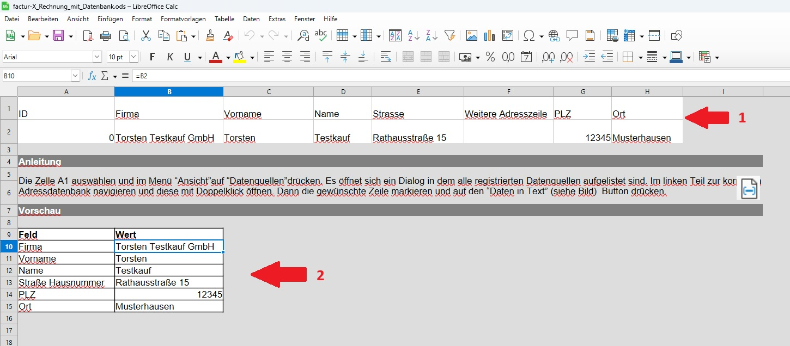

### Verknüpfung Datenquellen

Damit die Daten aus der Adressdatei in der Rechnung zur Verfügung stehen, muss einmalig eine Verknüpfung der Dateien in LibreOffice hergestellt werden. 

Klicken Sie in der Rechnungsvorlage in der Menüleiste auf `Ansicht` und dann `Datenquellen`. Es öffnen sich zwei Bereiche oberhalb der Rechnung. Der linke Teil enthält eine Liste verknüpfter Datenquellen, der Eintrag `Bibliography` ist ein Beispieleintrag der immer vorhanden ist. Ist die Adressdatenbank in diesem Fenster aufgeführt, kann der Rest dieses Abschnitts übersprungen werden.

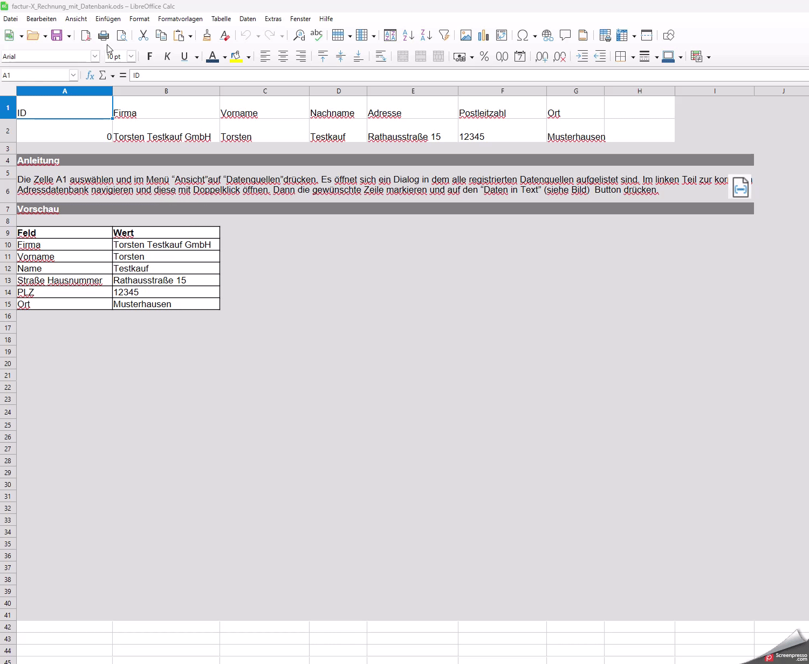

Klicken Sie mit der rechten Maustaste in das Feld und wählen Sie `Registrierte Datenbanken`aus.

Es öffnet sich ein neuer Dialog, klicken Sie erst auf `Neu` und dann auf `Durchsuchen`. Wählen Sie die Adressdatei aus und klicken Sie dann auf `Öffnen`. Bei Bedarf können Sie im Feld `Registrierter Name` den Namen anpassen, unter welchem die Adressdatei in LibreOffice angezeigt wird. Bestätigen Sie dann beide Dialoge mit `OK`.

Sie sehen die Adressdatenbank nun in dem Datenquellen-Bereich, in dem vorher nur der `Bibliography` Eintrag zu sehen war.

### Einfügen von Daten in die Rechnung

Um Kontaktdaten in die Rechnung einzufügen, stellen Sie sicher, dass die Rechnungsvorlage im Tab `Datenbankanbindung` ist und die Datenquellen-Ansicht eingeschaltet ist (Menü-> Ansicht -> Datenquellen oder Strg+Shift+F4). Klicken Sie auf das kleine Plus-Symbol neben dem Namen der Adressdatenbank in der Datenquellen-Ansicht und danach auf das kleine Plus neben dem Eintrag `Tabellen`. Mit einem Doppelklick auf den Namen der Adresstabelle (hier `Adressen`) erscheinen ihre Kundendaten im rechten Fenster der Datenquellen-Ansicht.

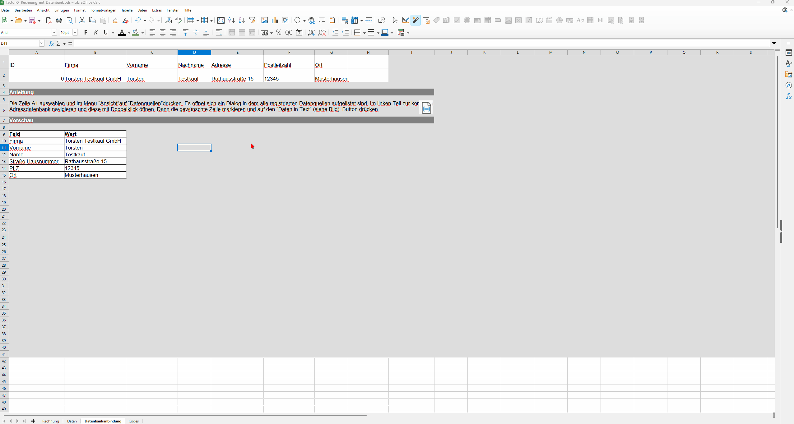

Um eine Adresse aus dieser Ansicht in die Rechnung einzufügen, führen Sie folgende Schritte aus:

1. Wählen Sie die gewünschte Adresse in der Datenansicht aus, indem Sie auf das graue Kästchen links neben der ID des Eintrags klicken. Die gesamte Zeile ist nun blau markiert.
2. Klicken Sie in das Feld `A1` des Tabellendokuments. Es enthält den Text ID.
3. Klicken Sie auf das `Daten in Text` Symbol.
4. Der gesamte Bereich `A1-G2` ist nun blau markiert und entält die ausgewählten Adressdaten.
5. Kontrollieren Sie im Vorschaubereich weiter unten im Dokument, dass die korrekten Daten angezeigt werden.
6. Wenn Sie nun zurück zum Tab `Rechnung` wechseln, sind die Adressdaten bereits eingetragen.

## Weiterführende Anpassungen der Vorlage

In Kapitel `Personalisierung der Vorlage` wurde erklärt wie das Aussehen der Rechnung auf einfache Art angepasst werden kann. Dieses Kapitel erklärt wie tiefgreifende Änderungen an der Vorlage vorgenommen werden können, ohne das die daraus entstehende E-Rechnung ungültig wird.

**Hinweis: Dieses Kapitel setzt Kenntnisse über die Verwendung von Formeln in LibreOffice Writer oder Microsoft Word voraus.**

### Wichtige Hinweise

Das finale Aussehen der Rechnung ergibt sich aus der Rechnungsansicht in Tab 1 der Vorlage. Alle kosmetischen Änderungen sollten in dieser Ansicht gemacht werden. Die Datenansicht dient als Grundlage der eingebetteten xml Datei. Dabei erwartet die Erweiterung bestimmte Daten in bestimmten Zeilen. 
**Die Zeilennummer der Einträge in der Datenansicht in Tab 2 darf NICHT verändert werden. Sonst kann keine gültige E-Rechnung generiert werden.** Die meisten Einträge der Datenansicht werden aus spezifischen Zellen der Rechnungsansicht ausgelesen. Die Zuweisung, welche Zelle in Tab 1 den gewünschten Wert enthält, kann problemlos angepasst werden.

### Anpassen der Rechnungsansicht

Diese Ansicht kann beliebig angepasst werden, solange die Datenansicht in Tab 2 weiterhin die korrekten Daten erhält. Außerdem muss die Datenbeziehung ALTERNATIVE beibehalten werden, damit die Rechnung gültig bleibt (siehe [Datenbeziehung Alternative](#die-datenbeziehung-alternative)).

### Anpassen der Datenansicht

Die Inhalte der Spalte B in Tab 2 der Vorlage werden ausgelesen, um den xml Teil der Rechnung zu füllen. Welche Zeile welchen Wert enthalten soll und in welchem Format, kann den anderen Spalten der Tabelle entnommen werden. Die Zuordnung jeder Zeile zu einem Wert im xml ist im python Quellcode des Makros hardgecoded.

Bei Anpassungen ist es notwendig, dass die Daten im richtigen Format vorliegen. In einigen Feldern werden auch Funktionen angewandt, um Teilstrings aus der Rechnungsansicht auszulesen oder zusammenzufügen. **Stellen Sie sicher, dass sie die aktuelle Zuweisung eines Feldes verstehen, bevor Sie dieses verändern.**

Es folgt eine kurze Erläuterung zu den Werten, die nicht direkt aus der Rechnungsansicht kopiert werden:

| Zeile | Wert | Bemerkung  |
|---|---|---|
| 3 | Typ | Es MUSS der String "rechnung" oder "gutschrift" im Feld stehen |
| 14| Postleitzahl | Postleitzahl und Stadt stehen im gleichen Feld, weshalb die ersten 5 Zeichen als PLZ interpretiert werden  |
| 15| Stadt | Postleitzahl und Stadt stehen im gleichen Feld, weshalb alle Zeichen bis auf die ersten 6 ausgelesen werden  |
| 16 | Land | Schlägt das Land im Codes-Tab nach, um den passenden 2 Buchstabencode herauszusuchen |
| 21 | Zusatz-Information| Zusammengesetzung aus Feld mit Beschreibung des Inhalts und dem Wert. Dies ist notwendig, da die Werte in ein Notiz Feld geschrieben werden und sonst nicht klar wäre, was der Wert bedeuten soll. |
| 22  | Zusatz-Information| Zusammengesetzung aus Feld mit Beschreibung des Inhalts und dem Wert. Dies ist notwendig, da die Werte in ein Notiz Feld geschrieben werden und sonst nicht klar wäre, was der Wert bedeuten soll. |
| 38-45 | Lieferadresse | Verweist auf Kundeninformation, da angenommen wird, dass Liefer- und Rechnungsadresse identisch sind |
| 50 | Währungscode | Währung der Rechnung, auf EUR festgelegt. Codes müssen ISO 4217 entsprechen.|
| 52-52 | Beträge | Die Wert Funktion konveritert den Feldinhalt zu einer Zahl ohne zusätzliche Währungszeichen oä |
| Steuerkategorie Spalte B | Steuerkategorie Code | Nimmt das erste Zeichen des entspr. Feldes. Die möglichen Steuerkategorien sind so definiert, dass der erste Buchstabe der Kategorie entspricht. Kategorie AE wird zur Zeit nicht unterstützt. |
|Steuerkategorie F | Grund | Die T Funktion sorgt dafür, dass das Feld leer bleibt, wenn kein Text vorhanden ist. Das verhindert, dass das Feld ungewollt den Wert "0" enthalten kann.|
| Position E | Einheitencode | Schägt den Einheitencode im Codes Tab nach. Codes müssen UN/ECE Rec No 20 entsprechen. Im Tab Codes findet sich nur eine Auswahl, welche aber erweitert werden kann. |
| Position G | Ust % | Zieht den Steuersatz aus der Spalte mit der Steuerkategorie jeder Position. Es wird die Klammer rechts entfernt, dann wird anhand der Gesamtlänge des Texts bestimmt ob der Prozentsatz ein- oder zweistellig ist. Dieser wird dann von rechts ausgelesen.
|Position I | Bemerkung | Die T Funktion sorgt dafür, dass das Feld leer bleibt, wenn kein Text vorhanden ist. Das verhindert, dass das Feld ungewollt den Wert "0" enthalten kann.|

Da die Anzahl der Steuerkategorien und Positionen variabel ist, werden diese Daten anders vom Makro ausgelesen. Für die Steuerkategorien wird geprüft, ob in Spalte A in Zeile 62 der Wert "1" steht. Wenn ja werden die Inhalte der anderen Spalten ausgelesen und als Steuerkategorie interpretiert. Dann wird kontrolliert ob in der nächsten Zeile der Wert "2" steht, und der Vorgang wird wiederholt. Die Schleife bricht ab, sobald eine Zelle in Spalte A nicht die nachfolgende Nummer enthält.

Für die Positionsdaten geht das Makro gleich vor, wobei die Startzeile sich aus 65 + Anzahl der Steuerkategorien ergibt.

## Fehlerbehandlung

Tritt ein Fehler auf, wird vor dem Export eine Messagebox mit der Fehlermeldung angezeigt. Bei schwerwiegenden Fehlern bricht der Export an dieser Stelle auch ab.

Die folgende Tabelle enthält eine Übersicht mit möglichen Fehlermeldungen und eine kurze Beschreibung über nötige Anpassungen, damit der nächste Export funktioniert. 

Falls Sie die Zellformatierung anpassen sollen, klicken Sie mit rechts auf die Zelle und wählen Sie 'Zellen formatieren' aus: Im ersten Tab wählen Sie den gewünschten Typ aus und prüfen Sie, dass das ausgewählte Format zu dem erwarteten Wert der Zelle passt.

| Fehlermeldung | Fehlerursache | Lösung
|---|---|---|
| Das Dokument muss mindestens zwei Tabs enthalten. | Es fehlen wichtige Tabs wie Daten- oder Rechnungsansicht. | Laden Sie die Vorlage neu herunter (siehe [Installation der Erweiterung]). |
| Der Wert von Zelle X in Tab zwei ist Y; er muss entwedewr 'rechnung' oder 'gutschrift' sein. | Das Feld Typ in Tab zwei enthält einen ungültigen Wert. Es muss eines der Wörter 'rechnung' oder 'gutschrfit' ohne ' und in Kleinbuchstaben enthalten. Prüfen Sie auch, dass keine Leerzeichen am Anfang oder Ende stehen. |
| Die Zelle X im zweiten Tab scheint kein Datumsfeld zu sein.Bitte überprüfen Sie das Format. Dazu klicken Sie mit rechts auf die Zelle und wählen Sie 'Zellen formatieren' aus: Im ersten Tab wählen Sie Datum als Kategorie und prüfen Sie, dass das ausgewählte Format zu dem Wert in der Zelle passt. | Der Inhalt der Zelle kann nicht als Datum interpretiert werden. | Prüfen Sie den Inhalt des Feldes und folgen Sie den Anweisungen in der Fehlermeldung.|
| Die Zelle X in Tab zwei is ein erforderliches Feld, aber entweder leer oder falsch formatiert. | Ein notwendiges Feld für eine gültige Factur-X Rechnung ist nicht ausgefüllt. | Füllen Sie das angegebene Feld aus. Welche Felder notwendig sind ist auch in Tab 2 farbig codiert. |
| Der Aussteller der Rechnung muss entweder eine Umsatzsteuer-Id oder eine Steuernummer angeben. | In Deutschland ist die Angabe von UstId oder Steuernummer vorgeschrieben. | Tragen Sie einen oder beide Werte ein. |
| Der Wert der Zelle X in Tab zwei ist Y; er muss eine Kommazahl sein. | Das Feld enthält keine Kommazahl. | Geben Sie eine Kommazahl ein, achten Sie auf die Zellformatierung und darauf den korrekten Trenner zu verwenden (',' in deutscher-, '.' in englischer Installation) |
| Der Wert der Zelle X in Tab zwei ist Y; er muss positiv sein. | Das Feld akzeptiert keine negativen Zahlen. | Prüfen Sie den Feldinhalt und prüfen Sie die Zellenformatierung. |
| Der Wert der Zelle X in Tab zwei ist Y; er muss eine Ganzzahl sein. | Das Feld akzeptiert keine Kommazahl. | Geben Sie eine Ganzzahl ein und prüfen Sie die Zellenformatierung. |
| Der Wert der Zelle X in Tab zwei ist Y; er muss eine Ganzzahl sein. | Das Feld aktzeptiert nur ein Datum. | Geben Sie ein Datum ein und prüfen Sie die Zellenformatierung. |
| Der Wert der Zelle X in Tab zwei ist Y; er muss ein Text sein. | Das Feld aktzeptiert nur Freitext. | Geben Sie einen Text ein und prüfen Sie die Zellenformatierung. |
| Ländercodes müssen zwei Buchstaben haben. | Die Landesangabe entspricht nicht DIN ISO 3166. | Wählen Sie in der Rechnungsansicht das Land in der Dropdown-Box aus. Haben Sie diese gelöscht, können Sie den 2-Buchstabencode auch im Tab 'Codes' manuell nachschlagen und in Tab 2 eintragen. |
| diese Umsatzsteuer-Id ist ungültig. | Die Umsatzsteuer-Id ist nicht gültig. | Prüfen Sie ihre Eingabe auf Tippfehler. |
| diese Steuernummer ist ungültig. | Die Steuernummer ist nicht gültig. | Prüfen Sie ihre Eingabe auf Tippfehler. |
| Währungscodes müssen drei Buchstaben haben. | Die Währungsangabe entspricht nicht ISO 4217 | Schlagen Sie den korrekten Code für die angegebene Währung nach. |
| Das Austelldatum der Rechnung muss heute sein. Wenn das eingetragene Datum stimmt, überprüfen Sie die Systemzeit ihres Computers. | Das Rechnungsdatum muss das tagesaktuelle Datum sein. | Geben Sie das aktuelle Datum ein. Prüfen Sie, dass die Systemzeit ihres Computers korrekt eingestellt ist, diese wird zur Überprüfung verwendet. |
| Das Fälligkeitsdatum kann nicht in der Vergangenheit liegen. | Zahlungsfristen dürfen den Gläubiger nicht unangemessen benachteiligen. | Geben Sie ein Datum ein, dass in der Zukunft liegt. Wenn nicht anders vereinbart gilt ein Frist von 30 Tagen (§286 Abs. 3 BGB).|
| Der Wert von Zelle X in Tab zwei muss gleich der Summe der Zellen Y und Z sein. | Es wurde ein Fehler in der Berechnung von Zelle X festgestellt. | Prüfen Sie die Berechnung manuell nach. Kontrollieren Sie die Werte, Formeln und Zellenformate. |
| Es konnten keine Positionsdaten gefunden werden. Stellen Sie sicher, dass die Positionen unterhalb der Kategoriedaten eingetragen sind und in Spalte A nummeriert sind, beginnend mit '1' | Es wurden keine Positionsdaten erkannt | Prüfen Sie, dass mindestens eine Position vorhanden ist. Die Positionstabelle beginnt direkt unter der Steuerkategorie-Tabelle, ohne Leerzeilen. Entfernen Sie solche und stellen Sie sicher, dass in Spalte A die Nummer der Position (1,2,3,... in dieser Reihenfolge) steht. |
| Rechnungen die Steuerkategorie O beinhalten, dürfen keine Positionen einer anderen Steuerkategorie enthalten | Eine Rechnung mit Steuerkategorie 'O' erlaubt keine anderen Steuerkategorien. | Stellen Sie eine separate Rechnung für die Positionen mit Kategorie 'O' aus. |
| Rechnungen die Steuerkategorie K beinhalten, müssen für Käufer und Verkäufer eine Umsatzsteuer-Id angeben. | Es fehlen Angaben zur Umsatzsteuer-Id. | Tragen Sie die Umsatzsteuer-Id von Käufer und Verkäufer ein.|
| Die Netto-Summe aller Positionen stimmt nicht mit der Gesamtsumme ohne Steuern überein. | Es wurde ein Fehler in der Berechnung deR Netto-Gesamtsumme gefunden. Prüfen Sie die Berechnung manuell nach. Kontrollieren Sie die Werte, Formeln und Zellenformate. |
| Es muss mindestens eine Position aufgeführt sein. | Sie versuchen eine Rechnung über nichts auszustellen. | Stellen Sie sicher, dass mindestens eine Positon vorhanden und in Rechnungs- und Datenansicht abgebildet ist. |
| Postion X: Die Nettosumme entspricht nicht dem Produkt aus Nettopreis und Menge | Es wurde ein Fehler in der Berechnung der Nettosumme einer Position gefunden. | Prüfen Sie die Berechnung manuell nach. Kontrollieren Sie die Werte, Formeln und Zellenformate. Der Nettobetrag einer Position ergibt sich aus Nettopreis multipliziert mit der Menge. |
| Es muss mindestens eine Steuerkategorie aufgeführt sein. | Es ist keine Steuerkategorie angegeben. | Geben Sie eine Steuerkategorie an, im Tab 'Codes' finden Sie eine Erklärung zu den unterstützten Kategorien.|
| Steuerkategorie X: Die Summe der Steuern entspricht nicht der Steuerrate des zu versteuernden Betrags. | Es wurde ein Fehler in der Berechnung der Steuersumme einer Kategorie gefunden. | Prüfen Sie die Berechnung manuell nach. Kontrollieren Sie die Werte, Formeln und Zellenformate. Die Summe der Steuern ergibt sich aus dem in der Kategorie zu versteuernden Betrag multipliziert mit der Steuerrate. |

