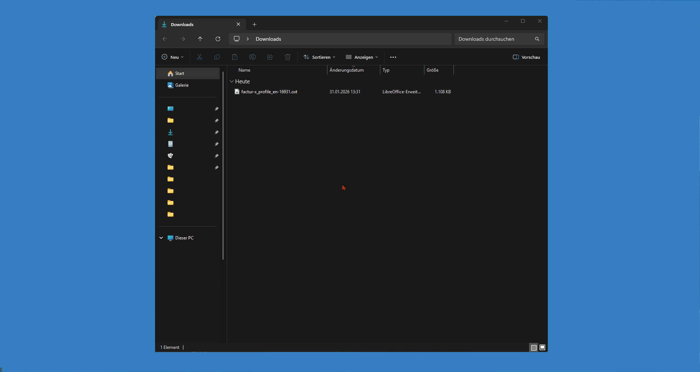
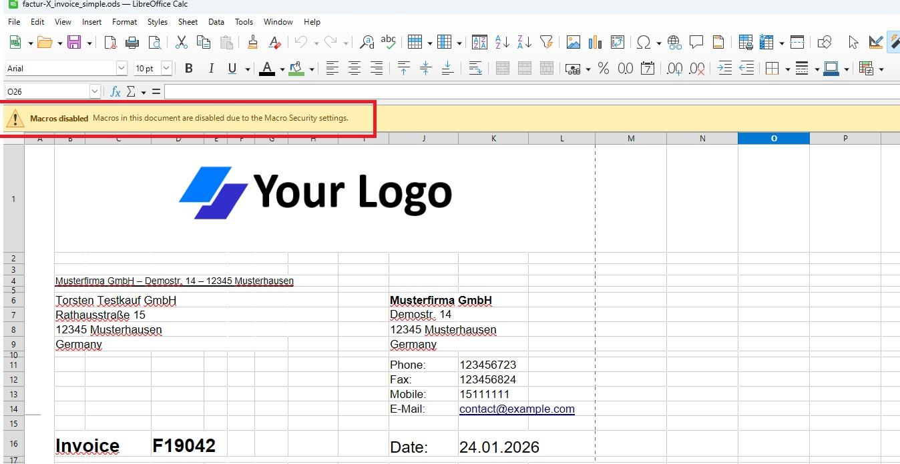
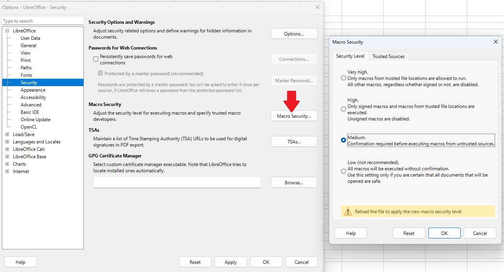
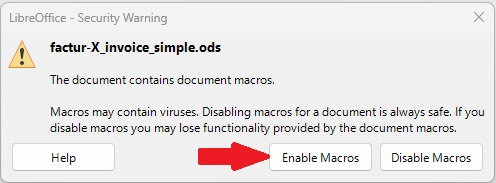
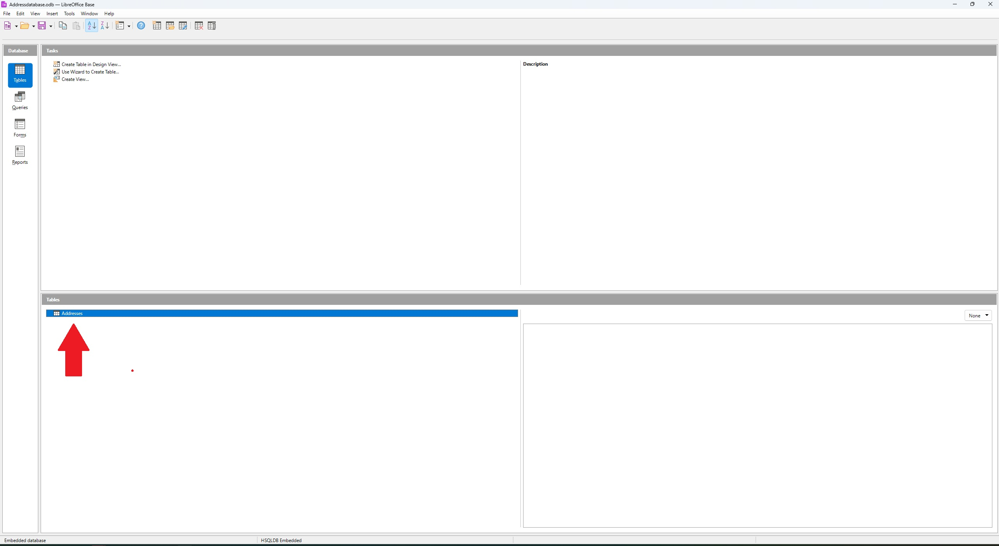
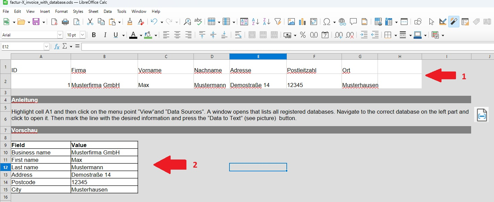
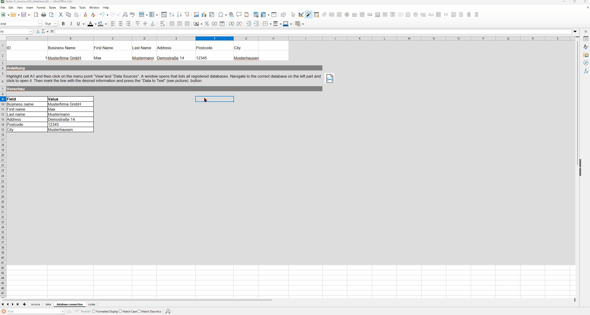
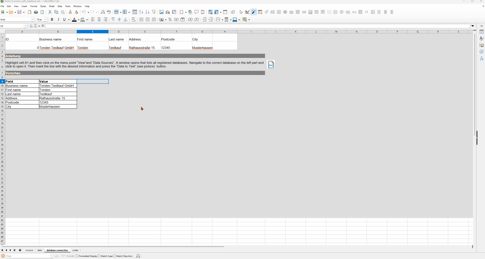

# User Guide

This guide explains the use of the "factur-x_profile_en-16931" LibreOffice extension together with the invoice template "factur-X_invoice_simple.ods" from the GitHub repository [zugferd-facturx-rechnungen-profil-en16931](https://github.com/Pityrias/zugferd-facturx-rechnungen-profil-en16931). Some workflows in this document are shown in animated form as `gif`. It is therefore recommended to view this guide online. If you want to see an image or animation larger, simply click on it in your browser.

- [User Guide](#user-guide)
  - [Installation](#installation)
    - [Installing LibreOffice](#installing-libreoffice)
    - [Installing the Extension](#installing-the-extension)
    - [Downloading the Template](#downloading-the-template)
    - [Macro Security Settings](#macro-security-settings)
    - [Testing the Macro](#testing-the-macro)
  - [Creating an Invoice](#creating-an-invoice)
    - [Important Notes](#important-notes)
      - [The Data Relationship ALTERNATIVE](#the-data-relationship-alternative)
      - [The profile basic](#the-profile-basic)
    - [Personalizing the Template](#personalizing-the-template)
    - [Entering General Invoice Information](#entering-general-invoice-information)
    - [Adjusting the Number of Positions or Tax Categories](#adjusting-the-number-of-positions-or-tax-categories)
      - [Notes on Tax Categories](#notes-on-tax-categories)
      - [Notes on Position Data](#notes-on-position-data)
      - [Adding and Removing Positions/Tax Categories](#adding-and-removing-positionstax-categories)
    - [Adjusting the VAT Breakdown and Total Amounts](#adjusting-the-vat-breakdown-and-total-amounts)
    - [Using the Template with Address Database Integration](#using-the-template-with-address-database-integration)
      - [Entering Addresses](#entering-addresses)
      - [Linking Data Sources](#linking-data-sources)
      - [Inserting Data into the Invoice](#inserting-data-into-the-invoice)
  - [Advanced Template Customizations](#advanced-template-customizations)
    - [Important Notes](#important-notes-1)
    - [Adjusting the Invoice View](#adjusting-the-invoice-view)
    - [Adjusting the Data View](#adjusting-the-data-view)
  - [Error Handling](#error-handling)

## Installation

### Installing LibreOffice

LibreOffice can be downloaded from https://de.libreoffice.org/download/download. Version 25.2.5 or newer should be installed. If you need help with the installation, you can find a guide [here](https://de.libreoffice.org/get-help/install-howto/).

### Installing the Extension

Download the file `factur-x_profile_en-16931.oxt` [here](https://github.com/Pityrias/zugferd-facturx-rechnungen-profil-en16931). Click on the file and then on the `Download raw` button at the top right.

Open the downloaded file with a double-click to install the extension.
The extension will now be displayed as installed. Click on `Close` and select `Start later`. Close LibreOffice now. If you see the installation dialog again when starting LibreOffice next time, you can close it with "Cancel".

### Downloading the Template

The extension reads the data for the XML part of the e-invoice from a specially formatted table in the second tab of the invoice file. An example invoice named `factur-X_invoice_simple.ods` can be downloaded [here](https://github.com/Pityrias/zugferd-facturx-rechnungen-profil-en16931). Open the template after downloading by double-clicking.

If a program other than LibreOffice opens, LibreOffice must still be configured as the default program for `ods` files. In this case, perform the following steps (under Windows):

1. Close the program in which the example invoice was opened.
2. Right-click on the invoice.
3. Move the mouse pointer over the "Open with" option.
4. A further context menu appears to the right of the current window.
5. Click on the "Choose another app" option in this window.
6. Select LibreOffice and confirm at the bottom with the "Always" button.
7. Double-click on the invoice; it will now open in LibreOffice.

### Macro Security Settings

Since LibreOffice extensions (also called macros) from unknown sources can pose a security risk, most macros are disabled by default in LibreOffice. To make this extension work, this setting must be adjusted.

If macros are disabled, the file looks like this after opening:

In this case, click on `Tools` in the menu bar and then on `Options`. In the following dialog, select the sub-item `Security` under `LibreOffice`. There you will find a `Macro Security` button. Click on it and then select the `Medium` option. With this setting, you will be asked each time you open a document whether you want to allow macros. Click on both `OK` buttons and restart LibreOffice for the changes to take effect.

When starting, you should now see the following dialog.

Click on `Enable Macros`.

The file `factur-X_invoice_simple.ods` should now be open without a macro security warning displayed at the top.

**Note: Macros can contain malware. Only enable macros in documents you trust.**

### Testing the Macro

This section tests the interaction between macro and template by creating an e-invoice with minimal adjustments. Later chapters explain how to customize the template for your own invoices. There you will find important notes on the legal requirements for the invoice.

To create an e-invoice directly from the template, perform the following steps:
1. Click on the `Invoice` tab at the bottom of the screen to display the invoice view. (see Invoice View Image)
2. Check that the `Date` field contains the current date.
3. Scroll down and check that the date behind `Payment due date:` is in the future. If not, change the date.

4. Click on the `data` tab at the bottom of the screen to open the data view. (see Data View Image)
5. Click on the `Generate Factur-X PDF Invoice` button.

6. Select a location, enter a filename, and click `Save`.

7. Open the PDF you just created and check that the file looks as expected. If you used Adobe Acrobat to open it, it should show that a `factur-x.xml` file is embedded.

## Creating an Invoice

This chapter explains what to consider when creating your own invoices and how to make small adjustments.

### Important Notes

To ensure that your invoice is valid according to german UStG, it should meet the following requirements from the Factur-X or ZUGFeRD standard:

1. Data relationship "ALTERNATIVE"
2. Minimum profile "Basic"

#### The Data Relationship ALTERNATIVE

The data relationship "ALTERNATIVE" means that the information in the human-readable and machine-readable parts of the invoice is redundant. For this invoice template, this means that all information from the invoice view must also be present in the data view - and vice versa. For most fields in the data view, there is a direct link to the values in the invoice view.

The following fields require manual adjustment:

- Issuer Additional Address Line 1 & 2: These fields allow additional address lines to be displayed. They are not present in the invoice view of the template and must be manually linked or filled in if needed.
- Issuer Federal State: Not present in the invoice view of the template and must be manually linked or filled in if needed.
- Issuer VAT ID: Mandatory field, in the template this information is placed in the footer. If you customize the footer, keep in mind that the VAT ID must still be present in both views and have the same value.
- Additional Footer Information: The invoice view of the template contains various, partly optional information. Since these are not assigned to any field in the Factur-X standard, they are inserted into a note text field. You can use the field for various information that does not fit elsewhere in the data view.
- Customer Additional Address Line 1 & 2: These fields allow additional address lines to be displayed. They are not present in the invoice view of the template and must be manually linked or filled in if needed.
- Customer Federal State: Not present in the invoice view of the template and must be manually linked or filled in if needed.
- Customer VAT ID: Not present in the invoice view of the template and must be manually linked or filled in if needed.
- Delivery Address Block: Currently takes the customer's address from the data view. Must be adjusted if the delivery address differs.
- Payment Terms Text: Information about special features such as discounts cannot be displayed directly in the data view and must therefore be mentioned in the description text of the payment terms.
- Currency Code: Fixed to Euro (EUR).
- Number of Additional Attachments: It is possible to embed additional files in the e-invoice. This has no influence on the validity of the invoice.
- Tax Category and Position Data Table: Since the number of positions and tax categories varies, the table must be adjusted accordingly. How this works is explained in the section [Adding and Removing Positions/Tax Categories](#adjusting-the-number-of-positions-or-tax-categories).

**Note:** If you have information in the invoice view that does not fit into any field in the data view, use one of the following fields:

* Note Text
* Additional Footer Information Bank Details
* Additional Footer Information Commercial Register
* Payment Terms Text
* Note field of Positions, if the information relates to a position

**Important: Before finalizing each invoice, check that the information in the data view matches that in the invoice view.**

#### The profile basic

To create a valid invoice, it must at least contain the information from the Basic profile of the Factur-X standard. This project has implemented a large number of optional but useful pieces of information. Which information is mandatory is color-coded in the data view.

* Blue: This information must always be present
* Green: This information is mandatory in certain situations, a short explanation can be found in the note field
* Yellow: This field is optional

The first column of the table names the information. The second column contains the value that will be written into the XML component of the e-invoice. This column also contains the color coding. The Type column describes the format of the value, i.e., whether it is text, a date, or something else. Ignoring this format leads to errors when creating the invoice. The last column contains explanations of the contents of the row.

The positions and tax categories can have a variable number of elements and are sorted differently for technical reasons. Here, each row contains a position or tax category and the associated information is entered in the columns. You need as many rows as you have positions or tax categories, and at least one must be present. How to adjust these tables is explained in the section [Adding and Removing Positions/Tax Categories](#adjusting-the-number-of-positions-or-tax-categories).

### Personalizing the Template

Before creating your first own invoice, remove the example logo at the beginning of the invoice. You can replace it with your own by clicking on `Insert` in the menu bar and then `Image`. You can of course also leave the area blank.

The size of the area is chosen so that the address field of the printed invoice is below the window of a DIN A4 envelope. For letter envelopes in DIN long format, fold marks are placed on the first invoice page. To adjust these distances, you can adjust the size of row 1 and column A. However, note that there is a preset print margin that is added during printing. The setting for this is in the menu under `Format` -> `Page Style` -> `General` in the `Page Margins` section.

In the next step, enter your contact details in the designated fields in the upper right area of the invoice. Don't forget to also adjust the line(s) above the recipient address. If you do not want to provide certain contact details, leave the field blank and delete the description text in the field before it. **If the now free line bothers you, reduce the size of the row, but do not delete it under any circumstances and do NOT move the content of the fields below up.**

Finally, fill out the footer. The information from the `Bank Details` and `Commercial Register` lines is inserted as free text into the XML file and can be replaced or left blank by you with any other information. **At least one of the fields VAT ID and Tax Number must be present and filled in.** For fields you do not want to use, you can of course also remove the description text.

Save the modified template now so that you do not have to repeat these general adjustments for each invoice.

### Entering General Invoice Information

After you have entered general information about your company, it is time to enter the invoice-specific information.

- Set whether it is an invoice or refund. To do this, click on the word `Invoice` before the invoice number and then on the small gray arrow that appeared next to the field to make a selection.
- Enter the invoice number.
- The issue date is automatically set to the current date.
- Enter the order reference (if available), otherwise leave the field blank.
- The delivery and service period must be a date in the format `dd.mm.yyyy`. If it is a period, enter the last day.
- Write the invoice text. Here you can also include information that does not fit into any other field of the template.
- Enter the due date under the document totals. This date must be in the future. The format is `dd.mm.yyyy`.
- Below that is space for the payment terms in text form. Here you can also specify special features such as special discounts. We also recommend entering the bank details here again.

### Adjusting the Number of Positions or Tax Categories

#### Notes on Tax Categories

The tax category table contains one row per used tax category, the first two rows explain the meaning of the individual columns. Note the following:

- Column A Number: Created automatically and is present for technical reasons.
- Column B Code: The official code of the tax category, from [UNTDID 5305](https://unece.org/fileadmin/DAM/trade/untdid/d16b/tred/tred5305.htm). Supported categories can be found in Tab 3 `codes`
- Column C Tax Rate: Please enter value without units and spaces
- Column D VAT Sum: Please enter value without units and spaces
- Column E Amount taxed by category: Please enter value without units and spaces
- Column F Reason for tax exemption: For taxation with 0%, a reason for the tax exemption can be specified here in text form.

#### Notes on Position Data

The position table contains one row per listed position, the first two rows explain the meaning of the individual columns. Note the following:

- Column A Number: Created automatically and is present for technical reasons.
- Column E Unit Code: Optional coding for the unit of quantity. These codes are defined in UN/ECE Recommendation No. 20 "Codes for Units of Measure Used in International Trade". Common example codes are listed in Tab 3 `codes`, for example the unit `pcs` is entered as `C62`.
- Column I Remark: Text field for information and remarks on the position that cannot be displayed otherwise.

#### Adding and Removing Positions/Tax Categories

The invoice template includes two positions and tax categories. Since adding new entries works the same for both tables, this chapter explains using the position data as an example. To add a new position, perform the following steps:

1. Click on the row number of the last position in the bar on the left. The entire row should now be selected.
2. Right-click and select `Insert Rows Below`.
3. There is now an empty row at the end of the table.
4. Click in the last filled row of the table and select the table entries. Move the mouse pointer to the lower right corner of the selected area. The cursor takes the form of a black cross. Hold down the left mouse button and drag the cursor over the row below. As soon as the lower row is highlighted with a pink border, release the mouse button.
5. The new row is now filled with values. The position number has been automatically incremented, other values have been copied from the row above. Adjust the values.
6. Once you have all positions in the position table, adjust the VAT breakdown.
7. Now the new positions must be added in the data view. Switch to the `data` tab.
8. Scroll down to the position table. If necessary, insert a new row below the last row. This works as described in step 2.
9. Repeat step 4. Select the contents of the last entry of the position data, move the mouse pointer to the lower right edge and hold the mouse button while dragging the now cross-shaped cursor downwards.
10. The new row should contain the information from the invoice view.

To remove a position or tax category, select the row as described in step 1, but click on `Delete Rows`.

### Adjusting the VAT Breakdown and Total Amounts

In the VAT breakdown, the taxable amount must be specified for each tax category that appears in the position data. Treat VAT (S) with 7% and 19% as two different categories. In the "Taxable Amount" column, enter the sum of all position net amounts that are taxed according to the category. The content of the other fields is calculated automatically.

Once the position and VAT data are complete, the document totals should also display the correct amounts. If a down payment has already been made, you can enter it.

**Important: Check all amounts!**

### Using the Template with Address Database Integration

In addition to the standard template `factur-X_invoice_simple.ods`, there is also an experimental template `factur-X_invoice_with_database.ods` [here](https://github.com/Pityrias/zugferd-facturx-rechnungen-profil-en16931). For this, please also download the file `Addressdatabase.odb`.

If you are prompted to install a "Java Runtime Environment" when opening the database, you can download it [here](https://www.java.com/de/download/manual.jsp).

#### Entering Addresses

The address database contains a table where you can enter your customers' addresses. Open the file and click on `Tables` in the database bar on the left. You now see the `Addresses` table in the lower half of the view. Open the table with a double-click.

Another window opens with a table view, here you can enter your customers' contact details. Once you have entered the necessary data, save and close both windows.

Open the invoice template `factur-X_invoice_with_database.ods`. This has an additional tab `database connection`. In this view you will find the insertion area (see marking "1" in the image) and the preview of the entered data (marking "2").

#### Linking Data Sources

To make the data from the address file available in the invoice, a link between the files must be established once in LibreOffice.

Click on `View` in the menu bar of the invoice template and then `Data Sources`. Two areas open above the invoice. The left part contains a list of linked data sources, the entry `Bibliography` is an example entry that is always present. If the address database is listed in this window, the rest of this section can be skipped.

Right-click in the field and select `Registered Databases`.

A new dialog opens, click first on `New` and then on `Browse`. Select the address file and then click `Open`. If necessary, you can adjust the name in the `Registered Name` field under which the address file is displayed in LibreOffice. Then confirm both dialogs with `OK`.

You now see the address database in the data sources area, where previously only the `Bibliography` entry was visible.

#### Inserting Data into the Invoice

To insert contact details into the invoice, make sure that the invoice template is in the `Database Connection` tab and the data sources view is enabled (Menu -> View -> Data Sources or Ctrl+Shift+F4). Click on the small plus symbol next to the name of the address database in the data sources view and then on the small plus next to the `Tables` entry. By double-clicking on the name of the address table (here `Addresses`), your customer data appears in the right window of the data sources view.

To insert an address from this view into the invoice, perform the following steps:

1. Select the desired address in the data view by clicking on the gray box to the left of the entry's ID. The entire row is now highlighted in blue.
2. Click in the `A1` field of the table document. It contains the text ID.
3. Click on the `Data to Text` symbol.
4. The entire area `A1-G2` is now highlighted in blue and contains the selected address data.
5. Check in the preview area further down in the document that the correct data is displayed.
6. If you now switch back to the `Invoice` tab, the address data is already entered.

## Advanced Template Customizations

In the chapter `Personalizing the Template`, it was explained how to customize the appearance of the invoice in a simple way. This chapter explains how to make in-depth changes to the template without making the resulting e-invoice invalid.

**Note: This chapter assumes knowledge of using formulas in LibreOffice.**

### Important Notes

The final appearance of the invoice results from the invoice view in Tab 1 of the template. All cosmetic changes should be made in this view. The data view in Tab 2 serves as the basis for the embedded XML file. The extension expects certain data in certain rows. 
**The line numbers of the entries in the data view in Tab 2 MUST NOT be changed. Otherwise, no valid e-invoice can be generated.** Most entries in the data view are read from specific cells in the invoice view. The assignment of which cell in Tab 1 contains the desired value can be easily adjusted.

### Adjusting the Invoice View

This view can be customized arbitrarily, as long as the data view in Tab 2 continues to receive the correct data. Additionally, the ALTERNATIVE data relationship must be maintained to keep the invoice valid (see [The Data Relationship ALTERNATIVE](#the-alternative-data-relationship)).

### Adjusting the Data View

The contents of column B in Tab 2 of the template are read to fill the XML part of the invoice. Which row should contain which value and in which format can be taken from the other columns of the table. The assignment of each row to a value in the XML is hardcoded in the Python source code of the macro.

When making adjustments, it is necessary that the data is in the correct format. In some fields, functions are also applied to extract or concatenate substrings from the invoice view. **Make sure you understand the current assignment of a field before you change it.**

The following is a brief explanation of the values that are not directly copied from the invoice view:

| Row | Value | Note |
|---|---|---|
| 3 | Type | The string "invoice" or "refund" MUST be in the field |
| 14| Postal Code | Postal code and city are in the same field, which is why the first 5 characters are interpreted as postal code |
| 15| City | Postal code and city are in the same field, which is why all characters except the first 6 are read |
| 16 | Country | Looks up the country in the `codes` tab to find the appropriate 2-letter code |
| 21 | Additional Information | Composition from field with description of the content and the value. This is necessary because the values are written into a note field and otherwise it would not be clear what the value represents. |
| 22 | Additional Information | Composition from field with description of the content and the value. This is necessary because the values are written into a note field and otherwise it would not be clear what the value represents. |
| 38-45 | Delivery Address | Refers to customer information, as it is assumed that delivery and billing address are identical |
| 50 | Currency Code | Currency of the invoice, fixed to EUR. Codes must comply with ISO 4217.|
| 52-57 | Amounts | The VALUE function converts the field content to a number without additional currency symbols etc. |
| Tax Category Column B | Tax Category Code | Takes the first character of the corresponding field. The possible tax categories are defined so that the first letter corresponds to the category. Category "AE" is not currently supported. |
|Tax Category F | Reason | The T function ensures that the field remains empty if no text is present. This prevents the field from unintentionally containing the value "0".|
| Position E | Unit Code | Looks up the unit code in the `codes` tab. Codes must comply with UN/ECE Rec No 20. In the `codes` tab, there is only a selection, which can be expanded. Do not forget to adjust the formula in Tab 2 so that it includes the new value in Tab 3. |
| Position G | VAT % | Pulls the tax rate from the column with the tax category of each position. The right parenthesis is removed, then based on the total length of the text it is determined whether the percentage is one or two digits. This is then read from the right.
|Position I | Note | The T function ensures that the field remains empty if no text is present. This prevents the field from unintentionally containing the value "0".|

Since the number of tax categories and positions varies, these are read differently by the macro. For tax categories, it is checked whether in column A in row 62 the value "1" is present. If yes, the contents of the other columns are read and interpreted as tax category. Then it is checked whether in the next row the value "2" is present, and the process is repeated. The loop breaks as soon as a cell in column A does not contain the subsequent number.

For position data, the macro proceeds in the same way, where the start row is calculated as 65 + number of tax categories.

## Error Handling

If an error occurs, a message box with the error message is displayed before the export. In case of serious errors, the export also aborts at this point.

The following table contains an overview of possible error messages and a brief description of the necessary adjustments so that the next export works. 

If you need to adjust the cell formatting, right-click on the cell and select `Format Cells`: In the first tab, select the desired type and check that the selected format matches the expected value of the cell.

| Error Message | Cause of Error | Solution
|---|---|---|
| The document must contain at least two tabs. | Important tabs such as data or invoice view are missing. | Download the template again (see [Installing the Extension](#installing-the-extension)). |
| The value of cell X in tab two is Y; it must be either 'rechnung' or 'gutschrift'. | The Type field in tab two contains an invalid value. It must contain one of the words `invoice` or `refund` in lowercase. Also check that there are no spaces at the beginning or end. |
| Cell X in the second tab does not appear to be a date field. Please check the format. To do this, right-click on the cell and select 'Format Cells': In the first tab, select Date as the category and check that the selected format matches the value in the cell. | The content of the cell cannot be interpreted as a date. | Check the content of the field and follow the instructions in the error message.|
| Cell X in tab two is a required field, but either empty or incorrectly formatted. | A necessary field for a valid Factur-X invoice is not filled. | Fill in the specified field. Which fields are necessary is also color-coded in Tab 2. |
| The issuer of the invoice must specify either a VAT ID or a tax number. | In Germany, the specification of VAT ID or tax number is mandatory. | Enter one or both values. |
| The value of cell X in tab two is Y; it must be a decimal number. | The field does not contain a decimal number. | Enter a decimal number, pay attention to the cell formatting and use the correct separator (`,` in German, `.` in English installation) |
| The value of cell X in tab two is Y; it must be positive. | The field does not accept negative numbers. | Check the field content and check the cell formatting. |
| The value of cell X in tab two is Y; it must be an integer. | The field does not accept decimal numbers. | Enter an integer and check the cell formatting. |
| The value of cell X in tab two is Y; it must be a date. | The field only accepts a date. | Enter a date and check the cell formatting. |
| The value of cell X in tab two is Y; it must be text. | The field only accepts text. | Enter text and check the cell formatting. |
| Country codes must have two letters. | The country specification does not comply with DIN ISO 3166. | Select the country in the invoice view from the dropdown box. If you have deleted it, you can also look up the 2-letter code manually in Tab 3 `codes` and enter it in Tab 2. |
| this VAT ID is invalid. | The VAT ID is not valid. | Check your input for typos. |
| this tax number is invalid. | The tax number is not valid. | Check your input for typos. |
| Currency codes must have three letters. | The currency specification does not comply with ISO 4217 | Look up the correct code for the specified currency. |
| The issue date of the invoice must be today. If the entered date is correct, check the system time of your computer. | The invoice date must be the current date. | Enter the current date. Check that your computer's system time is set correctly, as it is used for verification. |
| The due date cannot be in the past. | Payment terms must not unreasonably disadvantage the creditor. | Enter a date that is in the future. If not otherwise agreed, a period of 30 days applies (§286 Abs. 3 BGB).|
| The value of cell X in tab two must be equal to the sum of cells Y and Z. | An error in the calculation of cell X was detected. | Check the calculation manually. Check the values, formulas, and cell formats. |
| No position data could be found. Make sure that the positions are entered below the category data and numbered in column A, starting with `1` | No position data was recognized | Check that at least one position is present. The position table starts directly below the tax category table, without blank lines. Remove such lines and ensure that the position number (1,2,3,... in that order) is in column A. |
| Invoices that include tax category O may not contain positions of another tax category | An invoice with tax category `O` does not allow other tax categories. | Issue a separate invoice for the positions with category 'O'. |
| Invoices that include tax category K must specify a VAT ID for buyer and seller. | VAT ID information is missing. | Enter the VAT ID of buyer and seller.|
| The net sum of all positions does not match the total sum without taxes. | An error in the calculation of the net total sum was found. | Check the calculation manually. Check the values, formulas, and cell formats. |
| At least one position must be listed. | You are trying to issue an invoice for nothing. | Make sure that at least one position is present and represented in the invoice and data view. |
| Position X: The net sum does not correspond to the product of net price and quantity | An error in the calculation of the net sum of a position was found. | Check the calculation manually. Check the values, formulas, and cell formats. The net amount of a position results from net price multiplied by quantity. |
| At least one tax category must be listed. | No tax category is specified. | Specify a tax category, in the `codes` tab you will find an explanation of the supported categories.|
| Tax category X: The sum of taxes does not correspond to the tax rate of the taxable amount. | An error in the calculation of the tax sum of a category was found. | Check the calculation manually. Check the values, formulas, and cell formats. The sum of taxes results from the taxable amount in the category multiplied by the tax rate. |

